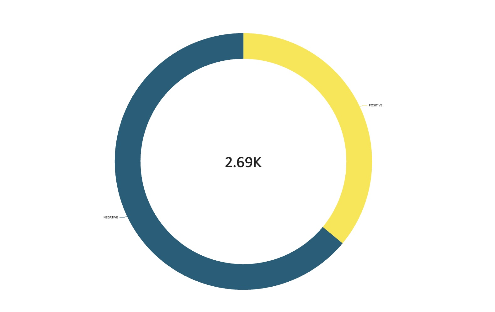

# Twitter Sentiment Analysis Proof-of-Concept

## Overview

This proof-of-concept searches Twitter for a search term entered by the user and then performs a sentiment analysis on it using the <a href="https://huggingface.co/distilbert/distilbert-base-uncased-finetuned-sst-2-english?text=I+like+you">distilbert/distilbert-base-uncased-finetuned-sst-2-english</a> transformer hosted on a Hugging Face inference endpoint.   The results are then displayed in a AWS Qucksight dashboard.

## Diagram

Below is a diagram illustrating the architecture:

## QuickSight Visualization

